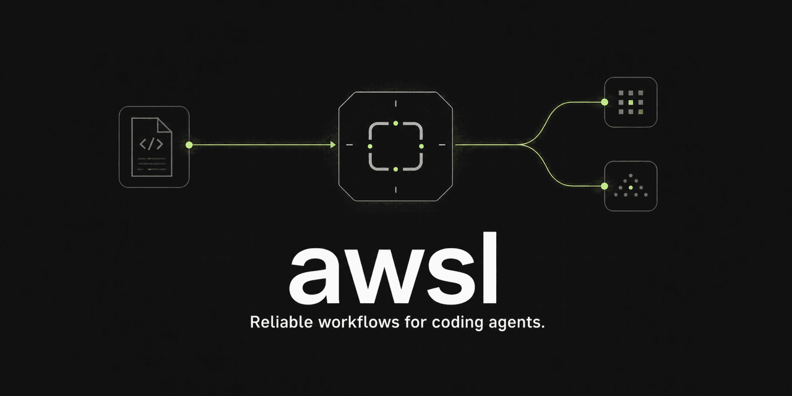

# awsl



[](https://www.npmjs.com/package/@xhinliang/awsl)
[](https://github.com/XhinLiang/awsl/actions/workflows/ci.yml)
[](package.json)
[](LICENSE)

> **The model is the worker. awsl is the runtime.**

Write trusted JavaScript workflows once, run them with Codex or Claude, and
resume them after interruption. awsl supplies the unglamorous runtime pieces
that multi-agent scripts usually rebuild: bounded parallelism, shared budgets,
durable journals, isolated Git worktrees, versioned events, and redaction.

awsl runs the provider CLIs you already use. It is local, inspectable, and
deliberately smaller than a general-purpose agent framework.

## Quick start

Install awsl and check the local provider setup:

```bash
npm install --global @xhinliang/awsl
awsl --install-skills
awsl doctor
```

`--install-skills` installs the awsl Codex Skill in
`~/.agents/skills/awsl`. It is safe to run again after upgrading awsl.

`doctor` reports every provider independently and bases overall readiness on
the selected provider. An unavailable unused provider does not degrade the
selected path. Versions with committed protocol evidence are `verified`; other
strictly branded semantic versions are `unverified` and may still run.

Create `review.js`:

```js
export const meta = {
  name: "review",
  description: "Ask two reviewers and synthesize their findings",
  phases: [
    { title: "review", detail: "Run independent reviews" },
    { title: "synthesize", detail: "Produce one answer" },
  ],
}

phase("review")
const reviews = await parallel([
  () => agent(`Review for correctness: ${args.request}`, { label: "correctness" }),
  () => agent(`Review for maintainability: ${args.request}`, { label: "maintainability" }),
])

if (reviews.some((review) => review === null)) {
  throw new Error("a required review failed")
}

phase("synthesize")
return agent(`Synthesize these reviews:\n${reviews.join("\n\n")}`, {
  label: "synthesis",
})
```

Run the same workflow with either supported provider:

```bash
awsl run review.js \
  --provider codex \
  --args '{"request":"the authentication module"}'

awsl run review.js \
  --provider claude \
  --args '{"request":"the authentication module"}'
```

One provider is pinned for the complete workflow tree. awsl never silently
falls back to another provider during a run.

## Why awsl

Provider CLIs are excellent workers. A workflow that coordinates many calls
still needs runtime semantics of its own.

| Without a workflow runtime | With awsl |
|---|---|
| Hand-written process and concurrency glue | `agent()`, `parallel()`, and `pipeline()` |
| Start over after interruption | Durable run state and longest-prefix resume |
| Shared checkout collisions | Per-call isolated Git worktrees |
| Ad hoc logs and parsing | Stable JSON, JSONL events, and terminal envelopes |
| Provider-specific orchestration | One JavaScript workflow for Codex or Claude |
| Unbounded or invisible spend | Shared output-token budgets and call limits |

```text
workflow.js ──> awsl runtime ──┬──> Codex CLI
                │              └──> Claude Code
                └── journal · budget · events · worktrees
```

[Read why awsl exists](docs/why-awsl.md), including when a direct provider CLI
or a general-purpose distributed workflow engine is the better choice.

## Example workflows

- [`research-panel.js`](examples/research-panel.js) — independent research and synthesis
- [`parallel-code-review.js`](examples/parallel-code-review.js) — parallel specialist review
- [`worktree-refactor.js`](examples/worktree-refactor.js) — isolated coding-agent worktrees
- [`resume-after-failure.js`](examples/resume-after-failure.js) — stable labels and durable reuse

The
[reporting migration case study](docs/case-studies/reporting-workflow.md)
shows how a real reporting application moved provider-neutral scheduling into
awsl while keeping collection, validation, persistence, and delivery in the
domain layer.

## Requirements and compatibility

- Node.js 22 or newer
- Git for `isolation: "worktree"`
- At least one Codex CLI or Claude Code executable with a standard semantic
  version banner

awsl owns and versions the JavaScript Workflow ABI independently from provider
executables. This release normalizes structurally compatible workflow files to
`awsl-workflow@1`. Codex CLI `0.145.0` and `0.146.0`, and Claude Code `2.1.218`,
have committed protocol evidence; newer versions are accepted as `unverified`
rather than rejected by a patch-version allowlist.

See the
[compatibility report](docs/compatibility/claude-code-2.1.218.md) for the
evidence behind each verified, partial, or unsupported behavior.

From a source checkout:

```bash
corepack enable
pnpm install --frozen-lockfile
pnpm run build
pnpm awsl --help
```

## CLI

```text
awsl <workflow>
awsl run <workflow>
awsl resume <run-id>
awsl runs list
awsl runs show <run-id>
awsl runs pause <run-id>
awsl doctor
awsl config show
awsl workflow inspect <workflow>
awsl --install-skills
awsl help <command>
```

`run` accepts:

```text
--provider codex|claude
--args <json>
--args-file <path|->
--cwd <path>
--budget <output-tokens>
--format auto|pretty|jsonl|json
```

`--args`, `--args-file`, and non-empty piped stdin are mutually exclusive.
Input JSON is strict, rejects duplicate keys, and is limited to 512 KiB.

`resume` accepts replacement `--args`, `--args-file`, `--budget`, and
`--format`. The workflow source identity, provider, executable, provider
profile, working directory, Workflow ABI, and model policy remain
pinned. Drift is rejected before another provider call starts.

Output contracts:

- `auto` selects `pretty` for a TTY and `jsonl` otherwise.
- `pretty` writes progress to stderr and the final business result to stdout.
- `jsonl` writes only versioned events to stdout.
- `json` writes one terminal envelope to stdout.
- `SIGINT` exits 130 and `SIGTERM` exits 143 after a durable terminal record.

`doctor` probes Node, Git, Codex, and Claude versions without invoking a model.
Its overall status follows the configured provider, while every provider keeps
an independent availability and evidence status.

## Workflow contract

The first statement must be a pure literal `export const meta = ...`.
`meta.name` and `meta.description` are required non-empty strings. Workflow
source is limited to 512 KiB and may use top-level `await` and `return`.
`awsl workflow inspect <file>` reports the normalized Workflow ABI. The ABI is
versioned by awsl rather than by the installed Claude or Codex executable.

The workflow global API is:

- `args`: the strict JSON input.
- `agent(prompt, options?)`: run one provider call.
- `parallel(thunks)`: run branches concurrently and preserve input order.
- `pipeline(items, ...stages)`: process items concurrently while stages for
  each item remain serial.
- `phase(title)`: change the current display and event phase.
- `log(message)` and `console.*`: emit workflow log events.
- `workflow(reference, args?)`: invoke one child workflow.
- `budget.total`, `budget.spent()`, and `budget.remaining()`.
- bounded `setTimeout` and `clearTimeout`.

Supported `agent` options are:

```js
{
  label: "stable call label",
  phase: "phase name",
  schema: { type: "object" },
  model: "provider model or configured tier",
  effort: "low" | "medium" | "high" | "xhigh" | "max",
  isolation: "worktree",
  agentType: "registered-agent-name",
}
```

Non-cancellation failures inside `parallel` and `pipeline` become `null` and
emit a log, matching the stable Workflow ABI. A `null` pipeline
value skips the remaining stages for that item. Child workflows inherit the
root provider and shared limits; a child cannot recursively start another child.

The VM deliberately exposes no `process`, `require`, filesystem API, CommonJS
globals, static or dynamic imports. String and WebAssembly code generation,
`Date.now()`, bare or zero-argument `Date`, and `Math.random()` are disabled.
This is a deterministic compatibility boundary, not a hostile-code sandbox.

## Configuration

Precedence, from highest to lowest:

```text
CLI > AWSL_* > <project>/.awsl/config.toml > user config > defaults
```

Recognized environment variables are:

- `AWSL_PROVIDER`
- `AWSL_STATE_DIR`
- `AWSL_RAW_PROVIDER_EVENTS`
- `AWSL_CODEX_COMMAND`
- `AWSL_CLAUDE_COMMAND`

The project config is `.awsl/config.toml`. On macOS, user configuration and
state live below `~/Library/Application Support/awsl`. On Linux and WSL they
use `${XDG_CONFIG_HOME:-~/.config}/awsl` and
`${XDG_STATE_HOME:-~/.local/state}/awsl`.

Example:

```toml
provider = "codex"
raw_provider_events = false

[providers.codex]
executable = "codex"
args = []
profile = "default"

[providers.codex.tiers.fast]
model = "gpt-5.6-terra"
effort = "low"

[registry]
plugin_dirs = []
```

Provider tables accept `executable`, `args`, `default_model`,
`native_models`, `tiers`, and `models`; `profile` is Codex-only.
`awsl config show` reports merged values, field provenance, and hashed config
sources, with defensive redaction.

Provider CLIs may apply their own ambient project rules, instructions, hooks,
MCP configuration, and permission settings. awsl does not independently
reproduce or certify every ambient provider setting. When a requested
`agentType` policy cannot be expressed by an adapter without broadening its
permissions, awsl fails closed.

## Durable state and resume

Runs have `running`, `paused`, `completed`, `failed`, or `killed` status. State
is private by default: directories use mode 0700 and state, journal, lock, and
optional raw-event files use mode 0600.

Resume replays only the longest valid contiguous `journal-key-v2` prefix.
Calls after the first missing or mismatched entry execute again. This gives
at-least-once behavior: if an external side effect completed but its successful
journal record was not durably stored, a resume can repeat that call. Workflow
authors must use idempotency keys or their own reconciliation for side effects.

Each logical provider call also has a bounded transient-failure retry: at most
three attempts with backoff. awsl retries only a provider error explicitly
classified as recoverable with complete zero-token usage. The Codex adapter
uses that classification only for transient transport or upstream failures
before any substantive item, command, or file change is observed. Authentication,
protocol, schema, and post-output failures are not retried automatically. A
`call.retrying` event is emitted before each fresh attempt; after exhaustion the
logical call fails normally and remains eligible for explicit durable resume.

`awsl runs pause` verifies both PID and process-start identity before signalling
the owner. Opening, listing, or resuming a run repairs only a verified stale
terminal lock.

## Worktrees

`agent(prompt, { isolation: "worktree" })` creates a per-call Git worktree from
the root run's pinned base. awsl never merges it into the original worktree.
Clean successful worktrees are removed; dirty, failed, or cancelled worktrees
are retained and reported for inspection.

## Events

The stable envelope is:

```json
{
  "version": 1,
  "type": "run.started",
  "timestamp": "2026-07-28T00:00:00.000Z",
  "runId": "opaque-run-id",
  "data": {}
}
```

Runtime event types include `run.started`, `run.completed`, `run.failed`,
`run.killed`, `run.paused`, `call.scheduled`, `call.started`,
`call.retrying`, `call.completed`, `call.failed`, `call.reused`, `phase.changed`,
`workflow.log`, `worktree.created`, and `worktree.retained`. Non-run CLI
commands can emit `command.completed`.

The `data` object is event-specific and may gain fields. Consumers should
dispatch on `version` and `type`, ignore unknown fields, and tolerate unknown
event types.

## Security boundary

Workflow files are trusted code. Provider processes are spawned directly with
an executable and argument vector, never through a shell. awsl does not save the
complete environment or provider credentials. Stored events and JSONL output
redact common authorization headers, cookies, tokens, passwords, credentials,
signatures, API keys, and AWS credential fields.

Raw provider event capture is disabled by default. Enabling
`raw_provider_events` or `AWSL_RAW_PROVIDER_EVENTS=true` creates additional
redacted diagnostic data, but users should still treat it as sensitive.

Report vulnerabilities through
[GitHub private vulnerability reporting](https://github.com/XhinLiang/awsl/security/advisories/new).
The `main` branch and latest release are supported; older releases are not.

Read [SECURITY.md](SECURITY.md) before running third-party workflows.

## Development

```bash
corepack enable
pnpm install --frozen-lockfile
pnpm run check
pnpm run test
pnpm run build
pnpm run test:package
pnpm run test:conformance
pnpm run sbom
git diff --check
```

CI runs the release gate on Node 22 for Ubuntu and macOS. Oracle capture is
explicitly opt-in and is never run by CI.

See [CONTRIBUTING.md](CONTRIBUTING.md) for the contribution workflow and the
evidence expected for compatibility changes.

The generated `sbom.cdx.json` is a deterministic CycloneDX 1.6 inventory of the
production dependency closure in `pnpm-lock.yaml`. It describes the release
build; dependency ranges can resolve differently in a later consumer install.

## Release prerequisites

`.github/workflows/release.yml` publishes only from a published GitHub Release
whose tag exactly matches `v<package version>`. The official repository pins
the package identity to `@xhinliang/awsl`, uses the `release.yml` npm trusted
publisher, and has immutable releases enabled.

Before each release, an authorized maintainer must confirm the required
licensing and organizational open-source approval. The release job uses GitHub
OIDC and npm provenance. It contains no long-lived npm publication token.

## License

awsl is licensed under the Apache License 2.0. Public CI uses an independently
authored 19-call orchestration profile. External and vendor fixtures are
excluded from the repository and release package.
