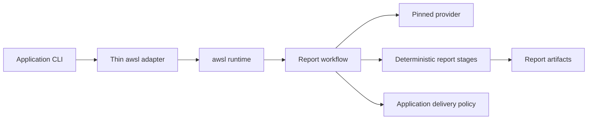

# Case Study: Shrinking a Reporting Application with awsl

> **Related implementation:** private application repository; links and organization-specific details are intentionally omitted.

## TL;DR

- A report-generation application had accumulated provider launch and scheduling code alongside its domain logic, without a reusable durable-resume layer.
- The migration kept one JavaScript workflow in the application and moved provider-neutral execution to awsl, while deterministic collection and delivery policy stayed in the domain layer.
- Executable failure-path tests cover required-branch failure, atomic multi-scope failure, and the one-rewrite success path. A sanitized Codex acceptance run completed 19 agent calls without a failed call.
- This case study does not claim authenticated Claude acceptance or exactly-once external side effects.

## Contents

- [Context](#context)
- [The original boundary](#the-original-boundary)
- [The boundary after migration](#the-boundary-after-migration)
- [Failure and resume semantics](#failure-and-resume-semantics)
- [Verification](#verification)
- [Outcome](#outcome)
- [Lessons](#lessons)

## Context

A private report-generation application collects source material,
prepares prompts, asks agents to summarize and synthesize results, validates the
report, persists artifacts, and applies delivery policy.

The original implementation also launched a provider directly and coordinated
its agent calls inside application modules. That worked, but provider concerns
and domain concerns evolved together. Adding another provider or changing
resume behavior required changes inside that application.

This document intentionally omits user identities, private repository URLs,
report contents, source-system records, and notification recipients.

## The original boundary

Before the migration, the application owned both sides of the execution boundary:

| Concern | Original owner |
|---|---|
| Collection, prompt preparation, linting, persistence | Application domain modules |
| Provider process launch and output parsing | Application provider adapter |
| Summary and finalization scheduling | Application workflows |
| Failure propagation and partial-result handling | Distributed across application orchestration |
| Delivery and notification policy | Application |

The main cost was duplication of runtime mechanics. Provider invocation,
concurrency, call metadata, and error translation had to be maintained next to
the report contract.

## The boundary after migration

The migrated design has one JavaScript orchestration entry point under the
application's `.claude/workflows/` directory. The application CLI invokes the
installed awsl package and validates its terminal JSON envelope.

The runtime and application responsibilities are now explicit:

| awsl owns | Application owns |
|---|---|
| Provider adapter and one-provider-per-run pin | Workflow source and report-specific ordering |
| Agent scheduling, phases, budgets, events, and durable resume | Collectors, checkpoints, prompt artifacts, and schemas |
| `parallel()` and `pipeline()` execution semantics | Required-source policy and multi-scope atomicity |
| Optional worktree lifecycle and runtime redaction | Lint, at-most-one rewrite, persistence, Git scope, and notification policy |

Deterministic stages remain callable independently for checkpoint control and
testing. The default end-to-end command uses awsl for every model-backed call;
the application no longer maintains its own Codex process adapter.

## Failure and resume semantics

awsl intentionally converts non-cancellation failures inside `parallel()` to
`null`. The report workflow treats that value according to its domain rules
instead of assuming every branch is optional.

| Condition | Application decision |
|---|---|
| A required source summary is missing | Fail the workflow before finalization or commit |
| One branch of a multi-scope run is missing | Fail the aggregate atomically and do not commit it |
| Final lint reports findings | Run at most one rewrite, lint again, then persist `ok` or `warn` |
| A delivery step may be replayed | Use repository preflight, scoped paths, and application reconciliation |

The last row follows awsl's at-least-once resume contract. The runtime can
reuse a durable completed call, but it cannot prove that an external effect did
not occur immediately before a crash. Delivery code therefore remains in the
domain layer where idempotency can be defined correctly.

## Verification

The migration added an executable harness around the real workflow body. It
uses awsl's public sandbox execution seam and injects deterministic agent
responses for three cases:

1. A required summary failure becomes a terminal failure with no finalization or commit.
2. A missing branch in the all-scopes path prevents aggregation and commit.
3. A successful path performs finalization, one rewrite, persistence, and one commit.

The full application suite passed 234 tests at migration time. A separate
sanitized Codex acceptance run completed 19 agent calls with no failed agent
calls and produced a non-empty report. The application returned a warning for
a report-lint finding, demonstrating that a completed awsl run and a domain
warning are separate states.

The live run also exercised an MCP-backed content source. It does not establish
general MCP compatibility, and no authenticated Claude execution was included
in this migration acceptance.

## Outcome

The migration changeset added 609 lines and removed 2,016 across application
code, tests, documentation, and the workflow. The net reduction mostly came
from deleting provider-specific orchestration and its duplicate tests; it is
not a performance benchmark.

More importantly, the ownership boundary became smaller and testable. The
application still contains the reporting system. awsl contains the reusable
runtime mechanics, and the adapter between them only constructs input, invokes
awsl, and validates the result envelope.

## Lessons

- Migrate the execution boundary before redesigning the domain workflow. The existing ordering and checkpoint contracts remained visible during the change.
- Convert runtime-level partial results into domain-level decisions explicitly. `null` is useful only when the workflow states whether that branch is optional.
- Keep irreversible or externally visible effects behind application preflight and reconciliation.
- Provider-neutral orchestration does not imply identical provider output. Validate each provider path and publish the remaining evidence gaps.
