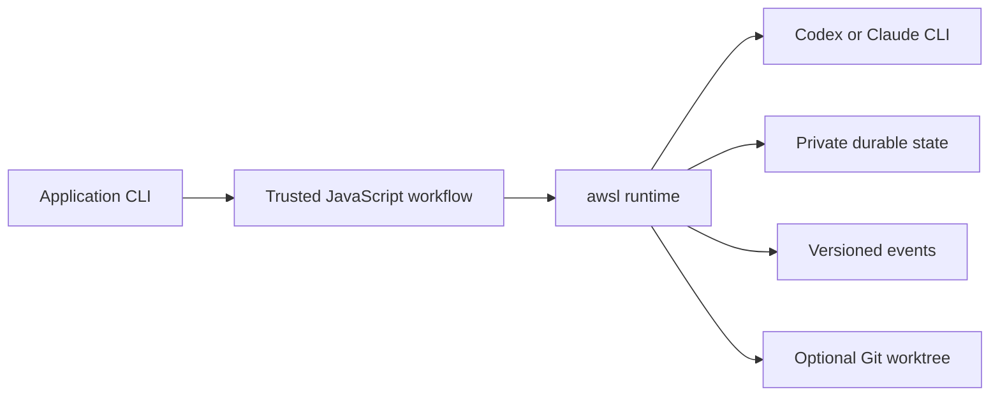

# Why awsl

## TL;DR

- Agent workflows need more than provider invocation once they run concurrently, survive interruption, or modify repositories.
- awsl supplies the runtime layer: provider pinning, scheduling, budgets, durable resume, worktree isolation, events, and redaction.
- Application code keeps its domain logic and side-effect policy. awsl is a trusted local workflow runtime, not a distributed queue or a sandbox for untrusted code.

> The model is the worker. awsl is the runtime.

## Contents

- [The gap between a prompt and a workflow](#the-gap-between-a-prompt-and-a-workflow)
- [What awsl owns](#what-awsl-owns)
- [What stays in application code](#what-stays-in-application-code)
- [Why the runtime has strict semantics](#why-the-runtime-has-strict-semantics)
- [How awsl compares](#how-awsl-compares)
- [When awsl fits](#when-awsl-fits)
- [Evidence and limits](#evidence-and-limits)

## The gap between a prompt and a workflow

A provider CLI can execute an agent turn. A production workflow also has to
answer operational questions: which calls may run together, what happens after
an interruption, which provider and model policy were used, and whether a
repository-changing call should be isolated.

Those concerns often begin as application-specific process wrappers. As the
workflow grows, the wrappers become a second runtime with implicit failure,
resume, and output contracts. awsl makes those contracts explicit while
leaving the workflow in ordinary JavaScript.

## What awsl owns

The workflow describes intent. awsl executes it against one pinned provider and
records enough state to inspect or resume the run.

The boundary gives the application one place for these runtime concerns:

| Concern | awsl contract |
|---|---|
| Provider execution | Direct shell-free launch of one provider for the complete workflow tree |
| Concurrency | Ordered `parallel()` results and serial-per-item `pipeline()` stages |
| Recovery | Longest-valid-prefix replay with durable run state |
| Limits | Shared output-token budget, concurrency limit, and call cap |
| Repository isolation | Per-call detached Git worktrees with explicit retention rules |
| Observability | Structured lifecycle events, phases, logs, and terminal envelopes |
| Sensitive state | Private file modes and defensive redaction of common credential shapes |

## What stays in application code

awsl does not know the application's business rules. The application still
owns data collection, prompts, schemas, artifact layout, validation, and the
meaning of success or warning states.

External side effects also remain an application responsibility. Resume has
at-least-once semantics, so a call may run again if its effect completed before
the success record became durable. Workflows that write, publish, or notify
need idempotency keys, preflight checks, or reconciliation appropriate to that
system.

## Why the runtime has strict semantics

One provider is fixed for a run and its child workflows. awsl does not silently
fall back between Codex and Claude because that would change the execution
contract during recovery.

Provider executable versions are compatibility inputs. Unsupported versions
fail closed instead of inheriting untested protocol behavior. Resume also
rejects drift in the workflow, provider, working directory, and model policy
before launching another call.

Workflow files run in a restricted deterministic VM without `process`,
`require`, filesystem APIs, imports, current time, or randomness. This keeps
orchestration reproducible, but it is not a security boundary for hostile
workflow source. Only trusted workflows should be executed.

## How awsl compares

The following table describes where orchestration responsibilities usually
live. Individual tools may provide additional capabilities.

| Approach | Useful when | Runtime work left to the application |
|---|---|---|
| Shell or process wrapper | A small number of linear calls | Durable replay, structured events, shared budgets, and worktree lifecycle |
| Provider-specific application code | Deep integration with one provider | Cross-provider workflow contract and provider-neutral run state |
| General job queue | Distributed task delivery is the primary need | Agent protocol normalization, model policy, and repository isolation |
| awsl | Trusted local workflows need explicit agent-runtime semantics | Domain logic, side-effect idempotency, and distributed scheduling |

awsl is deliberately narrower than a general automation platform. It focuses
on running coding-agent workflows on a local machine or CI host with observable
state and bounded behavior.

## When awsl fits

awsl is a good fit when a workflow has several agent calls, needs concurrency
or resumption, runs against a Git repository, or must expose machine-readable
events. It is also useful when the same workflow should select Codex or Claude
at run start without duplicating orchestration code.

Choose another layer when you need untrusted-code isolation, a distributed
queue, cross-provider fallback during a run, native Windows execution, or
compatibility with arbitrary provider versions. Application-specific scripts
remain simpler for short, disposable, single-call tasks.

## Evidence and limits

awsl publishes evidence by behavior rather than treating package publication as
proof of compatibility:

- The [compatibility report](compatibility/claude-code-2.1.218.md) separates verified, partial, and missing evidence.
- The [real Codex acceptance record](implementation/260729-real-codex-acceptance.md) documents two exact-provider scenarios and their limits.
- The [reporting migration](case-studies/reporting-workflow.md) shows how runtime and domain responsibilities were separated in an existing application.
- [SECURITY.md](../SECURITY.md) defines the supported versions and reporting channel.

Version `0.1.1` is published. Authenticated Claude workflow acceptance remains
an evidence gap, and the supported provider versions remain intentionally
exact rather than forward-compatible claims.
